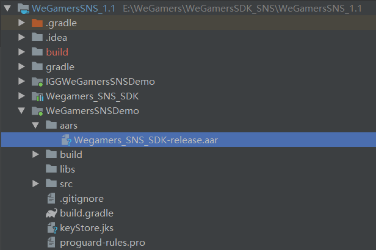

.. _topics-gradle配置:

================
Gradle配置
================

社区库引用配置
=========================

- 方式一（推荐）：使用WeGamers github仓库导入，在build.gradle文件配置如下

.. code-block:: c
	
	repositories {
		maven {
			url 'https://raw.githubusercontent.com/AppsInnova/WGCommunity/master/'
		}
	}
	
	dependencies {
		compile 'com.appsinnova.wegamers:community:1.0'
	}
	
- 方式二：在工程目录下生成目录文件aars，拷入aar文件Wegamers_SNS_SDK-release.aar

在build.gradle文件配置

.. code-block:: c

	repositories {
		flatDir {
			dirs 'aars'
		}
	}

公共库导入
=========================

- build.gradle文件下配置文件引用，导入aar需要的公共库，接入工程已存在公共库的不用导入

.. code-block:: c

	dependencies {
	
		compile fileTree(include: ['*.jar'], dir: 'libs')
		compile 'com.android.support:appcompat-v7:23.4.0'
		//Retrofit
		compile ('com.squareup.retrofit2:converter-gson:2.2.0'){
			exclude group: 'com.squareup.okhttp3'
			exclude group: 'com.google.code.gson'
		}
		compile 'com.google.code.gson:gson:2.7'
		compile 'com.squareup.retrofit2:adapter-rxjava:2.2.0'
		compile 'com.squareup.okhttp3:logging-interceptor:3.6.0'
		//Rxjava
		compile 'io.reactivex:rxandroid:1.2.0'
		//Dagger
		compile 'com.google.dagger:dagger:2.2'
		compile 'org.greenrobot:eventbus:3.0.0'
		
	}
