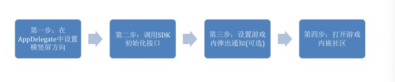
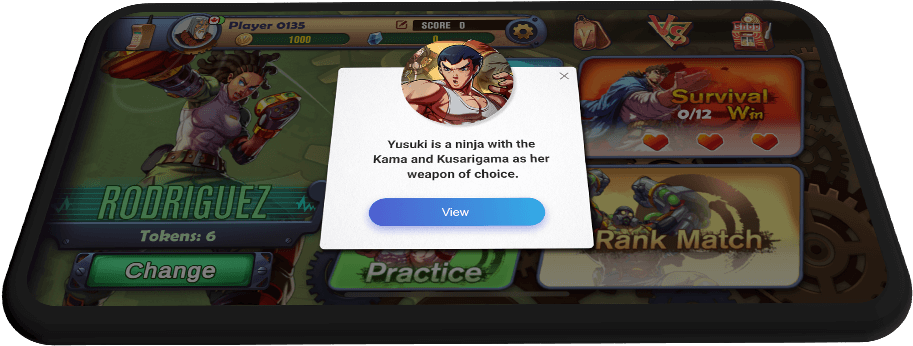

============
SDK入门指南
============

使用说明
============

- 第一步：在AppDelegate系统回调的函数中初始化游戏支持的横竖屏方向和设置内嵌社区支持的方向 详看Demo工程
- 第二步：SDK初始化接口

.. code-block:: c

    + (void)initGameCommunity:(WeGamersSDKParams*)param showCommunityRed:(void (^)(BOOL bShow))showNotifyRedBlock supportGameCommunity:(void (^)(BOOL bSupport))supportBlock;

- 第三步：设置游戏内弹窗通知(UI由SDK提供，内容在社区管理后台配置即可。请在合适的游戏界面调用该接口，建议在游戏启动完成后检测一次即可（不要使用轮询，并避开新手教程、战斗等场景）

.. code-block:: c

    + (void)checkGameCommunityNotice:(UIWindow *)window completionBlock:(void (^)(NSError * _Nullable error))completionHandler;

功能描述：弹出式通知直接展现在游戏界面中，玩家点击即可进入社区指定内容，为社区运营者提供一个非常高效的方式，来完成社区重要内容的传播到达。（如下图）

- 第四步：打开游戏内嵌社区接口

.. code-block:: c

    + (GameCommunityEntryResult *)openGameCommunityHomePageAndwillExitLive:(void (^)(void))blockWillExit

游戏中点击游戏社区事件中调用此接口

Demo工程
========

Demo请参考附件中的GameCommunityDemo工程