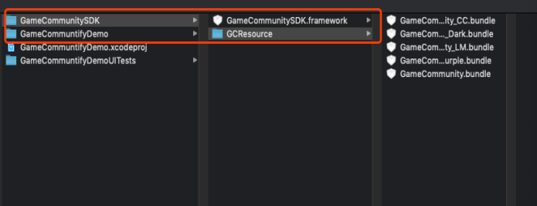
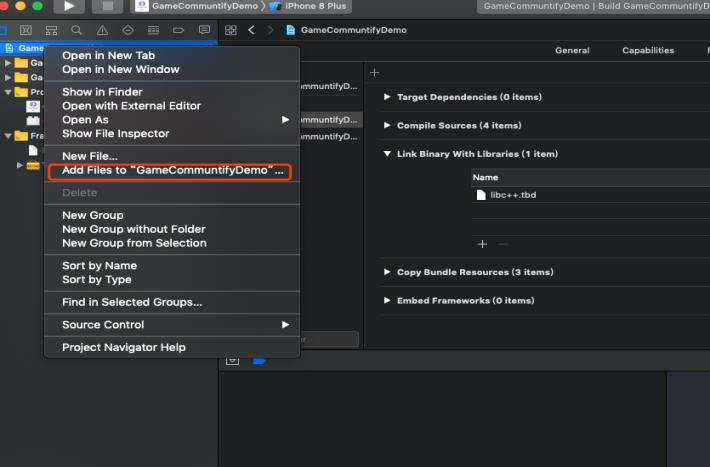
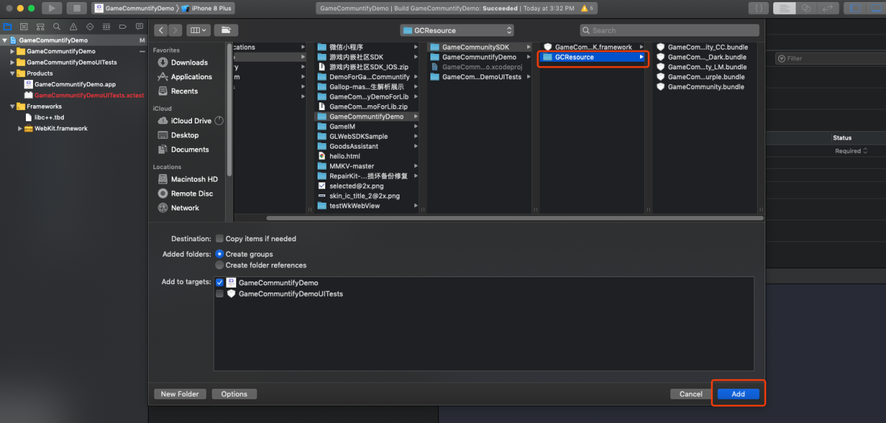
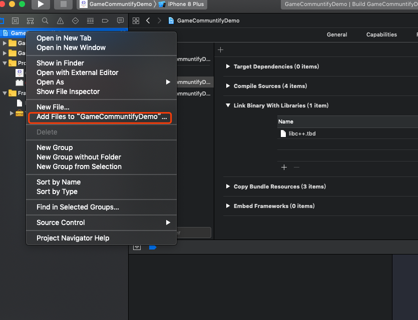
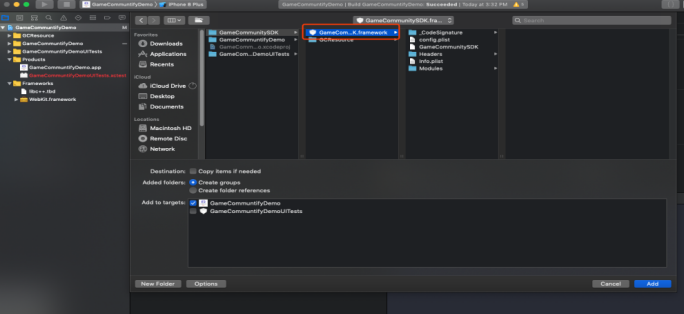

============
Pod 接入方式
============

说明：如果开发者工程支持Pod接入第三方库，只需在Podfile加入一句配置代码重新Pod Install即可（配置代码如下所示），使用Pod库接入就无须做资源导入以及工程配置操作

.. code-block:: c

	pod 'WGCommunity', :git => "https://github.com/dev8ios/WGCommunity.git"

============
SDK资源导入
============

拷贝资源文件到对应工程目录下
=========================

添加bundle资源
==============

注：五个bundle资源根据自己工程需求选择对应的bundle资源也可以五个bundle资源都选（同时配置对应的WeGamersSDKParams中的 GameCommunityThemType skinType）

.. image::  ../images/image4.jpg

添加framework
================

.. image::  ../images/image7.jpg